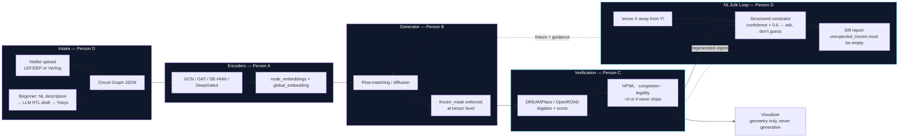

<div align="center">


<a href="https://github.com/nikhil191206/SiliconMind">
  
</a>

<br/>


</div>

<br/>

## What this is

Given a synthesized netlist, **SiliconMind** produces a physically valid, optimized
placement — the `(x, y)` of every macro and standard cell — using a generative deep
learning pipeline, benchmarked honestly against classical and RL-based placers, with
a **natural-language iterative refinement loop** layered on top so a chip designer can
say *"move this block away from the clock tree"* and get a re-legalized layout back
with a diff report, not a black box.

Full binding spec: **[TECHNICAL.md](TECHNICAL.md)**. If anything below ever
disagrees with it, TECHNICAL.md wins.

<br/>

## Pipeline



<br/>

## Why generative, not RL

> Independent replication has repeatedly shown classical simulated annealing beating
> RL-based placement (the Circuit Training/AlphaChip lineage) on standard benchmarks.
> Flow-matching placers currently outperform diffusion, RL, and DREAMPlace on multiple
> metrics — generating full layouts in seconds via zero-shot inference.

RL is reproduced here **only as an honest baseline**, never as the shipped approach.
Full reasoning: [TECHNICAL.md §1.6](TECHNICAL.md#16-why-generative-over-rl-do-not-silently-revert).

<br/>

## Four tracks, one system

<table>
<tr><td width="25%" align="center"><b>A — Encoders</b></td><td>Reproduces GCN, GAT, DE-HNN, and DeepGate4 from their papers and runs the comparative benchmark that justifies the final DE-HNN+DeepGate4 hybrid.</td></tr>
<tr><td align="center"><b>B — Generator</b></td><td>The flow-matching/diffusion engine itself, plus the hard-freezing mechanism that makes editing possible without unintended drift.</td></tr>
<tr><td align="center"><b>C — Verification</b></td><td>DREAMPlace/OpenROAD integration, the RL baseline reproduction, and the metrics/statistics pipeline everyone else's results depend on.</td></tr>
<tr><td align="center"><b>D — LLM & Intake</b></td><td>Yosys synthesis, LLM-assisted RTL drafting, NL→constraint parsing, and the diff-report that shows exactly what changed.</td></tr>
</table>

Frontend is picked up by all four together once the backend works end-to-end — split
by feature, not handed off as "just UI." Full detail: **[workDistribution.md](workDistribution.md)**.

<br/>

## Real data only

No Kaggle, no synthetic/crowd-sourced datasets, anywhere in this project.

| Source | Used for |
|---|---|
| [ISPD 2005](https://archive.sigda.org/ispd2005/contest.htm) · [ISPD 2015](http://www.ispd.cc/contests/15/web/downloads.html) | Core placement benchmarks |
| [Circuit Training (Ariane, Google)](https://github.com/google-research/circuit_training) | Real RISC-V netlist + baseline placement |
| [TILOS-AI MacroPlacement](https://github.com/TILOS-AI-Institute/MacroPlacement) | Ariane / BlackParrot / MemPool + SA baseline reference |
| [CircuitNet](https://circuitnet.github.io/) | Encoder pretraining (10K–20K real EDA tool runs) |
| [ASAP7 PDK](https://github.com/The-OpenROAD-Project/asap7) | 7nm-class synthesis/placement enablement |
| [OpenHW CORE-V](https://github.com/openhwgroup/core-v-cores) | Beginner-path RTL + generalization split |

Full fetch instructions and live checklist: **[data/README.md](data/README.md)**.

<br/>

## Build status

<!-- Update the checkmarks as each module lands real (non-mock) code. -->

- [x] Repo skeleton, shared schemas (`shared/schemas/`), mocks (`shared/mocks/`), config
- [x] **Person A — Encoders**: `NetlistEncoder` interface + GCN, GAT, DE-HNN, DeepGate4, all passing their schema/shape/determinism/non-mutation unit tests against mock data (`tests/unit/encoders/`, 27/27 green)
- [ ] **Person B — Generator**: flow-matching engine + freeze-mask enforcement
- [x] **Person C — Verification**: `shared/metrics/` (HPWL, congestion, legality) + DREAMPlace/OpenROAD subprocess wrapper + Bookshelf/DEF I/O + RL-baseline environment + `compare_methods` stats utility, all unit-tested against mocks/fakes/hand-computed toy data (`tests/unit/evaluation/`, 52/52 green, +1 skipped without stable-baselines3/torch installed). Real DREAMPlace/OpenROAD runs and RL-baseline training are blocked on tool installation and real datasets — see `modules/evaluation/NOTES.md`.
- [ ] **Person D — Intake/LLM**: Yosys pipeline, Bookshelf/LEF-DEF/protobuf parsers, NL constraint parser
- [ ] Real-data training (blocked on D's raw-format → Circuit Graph JSON parsers)
- [ ] Backend (FastAPI) wiring
- [ ] Frontend (shared, once backend is stable end-to-end)

<br/>

## Getting started

```bash
git clone https://github.com/nikhil191206/SiliconMind.git
cd SiliconMind

pip install -r requirements-shared.txt --index-url https://download.pytorch.org/whl/cu121
pip install -r modules/encoders/requirements.txt   # + other modules as needed

pytest tests/unit/encoders/   # 27 passing
```

Full setup, GPU/CUDA notes, and per-module test commands: **[environment_setup.md](environment_setup.md)**.

<br/>

## Repository map

```
SiliconMind/
├── TECHNICAL.md          ← binding spec: architecture, schemas, formulas, hyperparameters
├── workDistribution.md   ← who owns what
├── INSTRUCTIONS.md       ← execution order / what can build ahead of real data
├── config/               ← shared_config.yaml — single source of truth for seeds/splits/paths
├── data/                 ← raw (gitignored) + processed Circuit Graph JSON cache
├── modules/
│   ├── encoders/         ← Person A (done)
│   ├── generator/        ← Person B
│   ├── evaluation/       ← Person C
│   ├── intake/           ← Person D
│   └── llm_interaction/  ← Person D
├── shared/
│   ├── schemas/          ← the Section 3 data contracts, pydantic, imported everywhere
│   ├── metrics/          ← HPWL / congestion / legality — one source of truth (Person C)
│   └── mocks/            ← lets every track build in parallel before the others exist
├── backend/              ← FastAPI, wires modules together
├── frontend/             ← React, shared final layer
└── tests/
    ├── unit/             ← one folder per module
    └── integration/      ← cross-module, once two tracks are wired
```

<br/>

## Contributing

Branch naming, ownership boundaries, and the schema-change/mock-update rule:
**[CONTRIBUTING.md](CONTRIBUTING.md)**. Short version: own your `modules/<you>/`,
get review on anything in `shared/`.

Starting Person D's track? **[HANDOFF_FOR_PERSON_D.md](HANDOFF_FOR_PERSON_D.md)**
summarizes what A, B, and C actually built — interfaces, flagged deviations,
and what's still blocked — so you don't have to reverse-engineer three
modules before starting your own.

<br/>

<div align="center">

</div>
